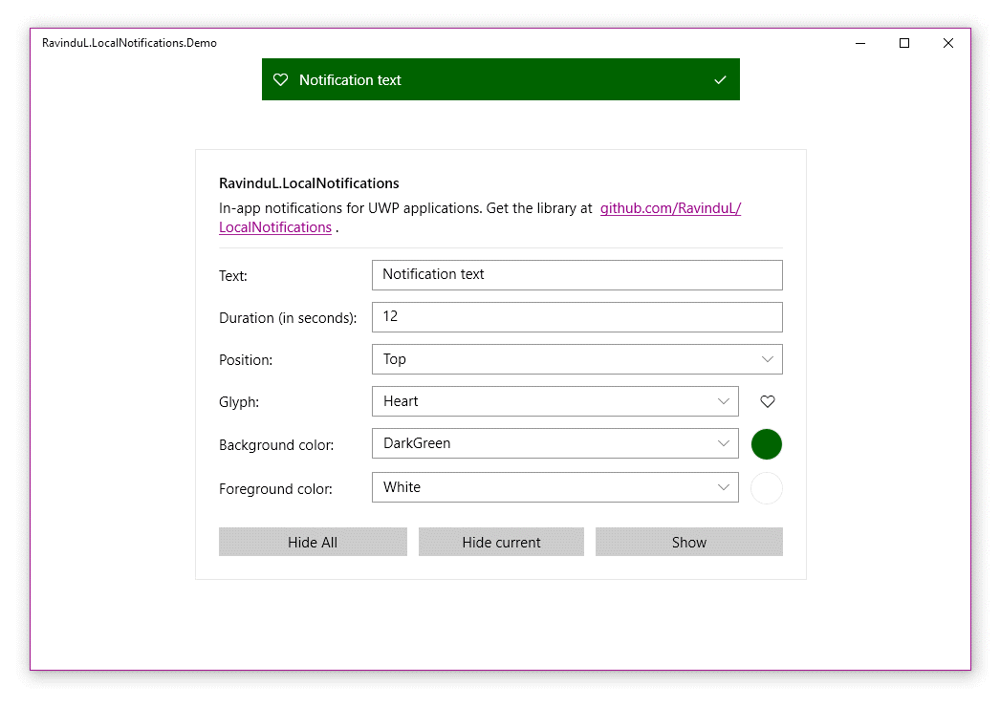

# LocalNotifications

 

LocalNotifications is a library to create and manage in-app notifications in Universal Windows application projects. Visit the [project website](https://ravindul.github.io/LocalNotifications/) for guides, documentation and reference. Click [here](https://ravindul.github.io/LocalNotifications/html/_getting_started.html) to get started using the library in your projects. 

## Looking for v1?
Version 1 of the project was moved to the branch [v1](https://github.com/RavinduL/LocalNotifications/tree/v1/), and will no longer be updated. Old versions of the package will still be available for download via NuGet. 

 